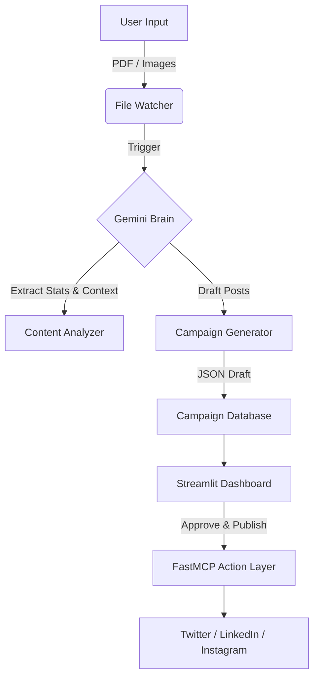

# Amplifier 🚀
> **The AI-Powered Campaign Manager for Non-Profits**

[](https://www.python.org/downloads/)
[](https://streamlit.io)
[](https://deepmind.google/technologies/gemini/)
[](https://github.com/punkpeye/fastmcp)

**Amplifier** is an intelligent automation platform designed to bridge the gap between impactful on-ground work and digital visibility. It empowers non-profits, activists, and small organizations to generate professional, multi-platform social media campaigns from raw assets (PDF reports, event photos) in seconds.

---

## 🏗️ Architecture



## ✨ Key Features

### 🧠 Cognitive Intelligence
*   **Document Understanding**: Parses complex Annual Reports (PDF) to extract key statistics, mission statements, and "Call to Action" points.
*   **Computer Vision**: Analyzes event photos to determine emotional tone and generate relevant captions.

### ⚡ Automated Content Studio
*   **Twitter Threads**: Converts dense reports into engaging, threaded narratives.
*   **LinkedIn Articles**: Drafts professional updates focused on systemic impact.
*   **Instagram Captions**: Generates emotionally resonant stories for visual content.

### 🖥️ Premium Dashboard
*   **Dark-Mode UI**: Built with Streamlit for a sleek, modern experience.
*   **Drag-and-Drop**: Seamlessly ingest assets.
*   **WYSIWYG Editor**: Review and refine AI-generated drafts before publishing.

### 🛠️ Extensible Action Layer
*   **FastMCP Integration**: Built on the Model Context Protocol standard.
*   **Modular Tools**: Easily swap "Mock" drivers for real API integrations (Twitter v2, LinkedIn) without changing application logic.

---

## 🚀 Quick Start

### Prerequisites
*   Python 3.10+
*   A Google Cloud Project with **Gemini API** access.

### Installation

1.  **Clone the repository**
    ```bash
    git clone https://github.com/yourusername/amplifier.git
    cd amplifier
    ```

2.  **Set up Virtual Environment**
    ```bash
    python3 -m venv venv
    source venv/bin/activate
    ```

3.  **Install Dependencies**
    ```bash
    pip install -r requirements.txt
    ```

4.  **Configure Environment**
    Create a `.env` file in the root directory:
    ```bash
    GEMINI_API_KEY=your_gemini_api_key_here
    ```

### Usage

#### 1. Start the Dashboard
Launch the web interface to manage your campaigns.
```bash
streamlit run app.py
```

#### 2. Run the Background Service (Optional)
If you prefer the "Drop Folder" workflow (headless mode):
```bash
python main.py
```
*Drop files into the `input/` folder to see them processed automatically.*

---

## 📦 Project Structure

```
amplifier/
├── input/                  # Drop folder for raw assets
├── output/                 # Storage for generated campaign JSONs
├── brain/
│   ├── analyzer.py         # Gemini Vision & Text extraction logic
│   └── generator.py        # Campaign drafting logic
├── app.py                  # Streamlit Dashboard entry point
├── main.py                 # Headless File Watcher entry point
├── server.py               # FastMCP Server (Action Layer)
├── models.py               # Pydantic Data Models
└── requirements.txt        # Python dependencies
```

## 🤝 Contributing

We welcome contributions! Please see `CONTRIBUTING.md` for details on how to submit pull requests, report issues, and request features.

## 📄 License

This project is licensed under the MIT License - see the [LICENSE](LICENSE) file for details.
